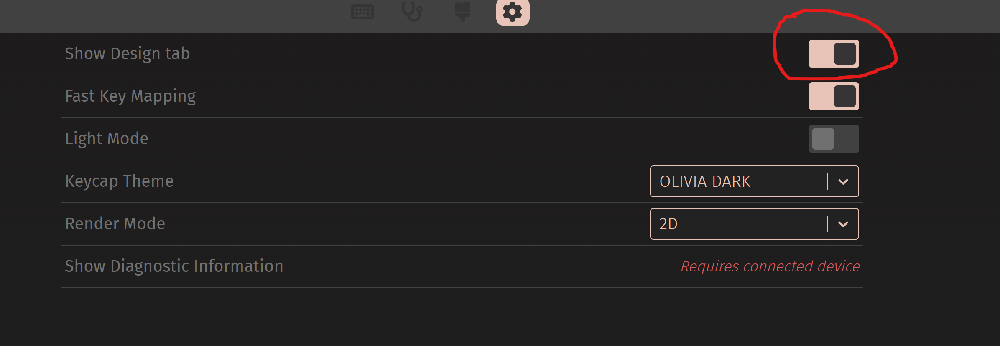
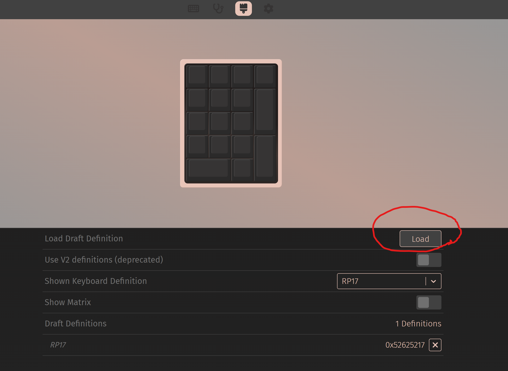
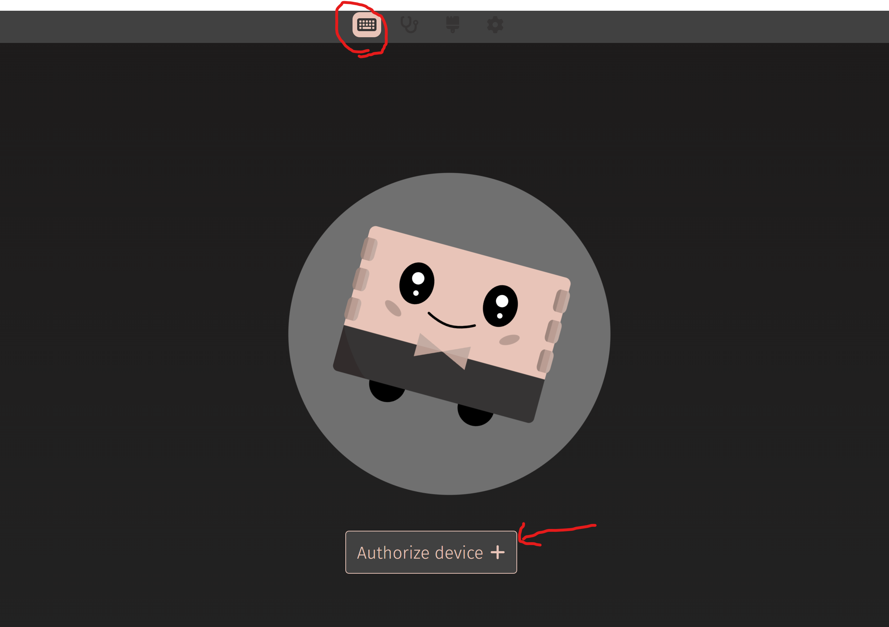
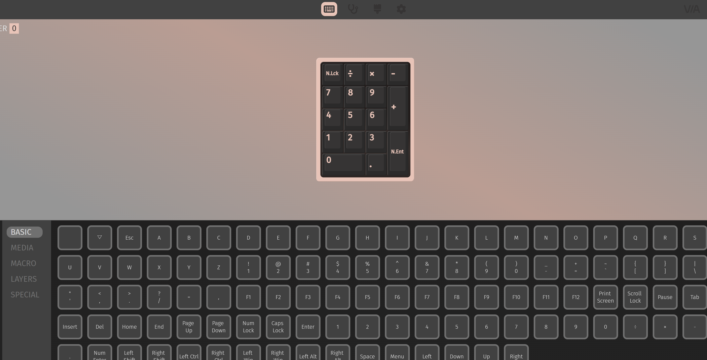
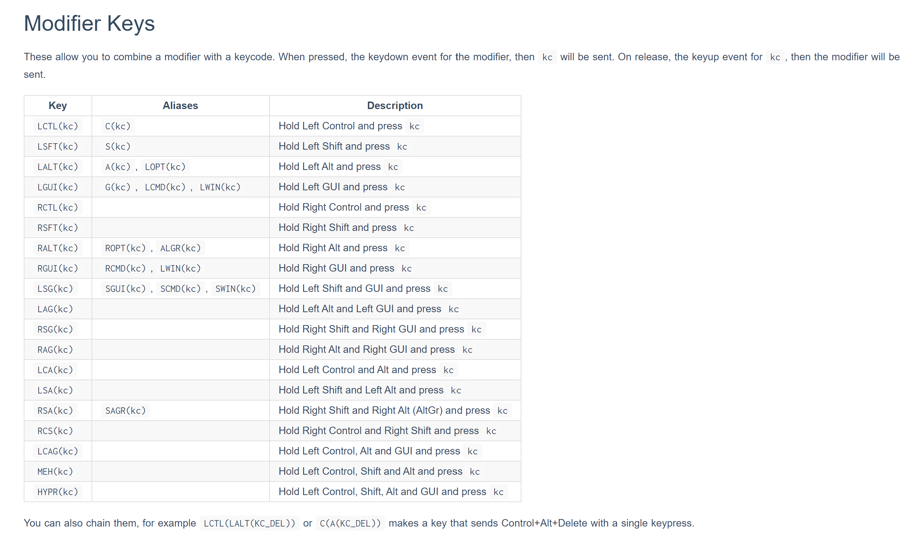
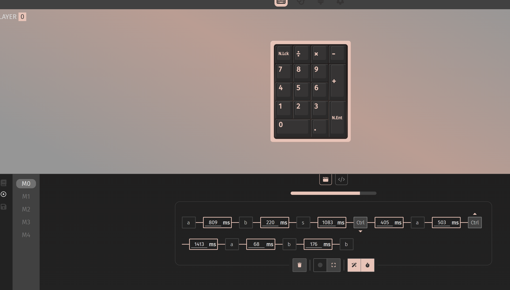

## 适配轻量qmk功能到ch552, 基于ch55xduino

### 功能特性

* via改键，键值可设置为普通键，多媒体键，系统键，鼠标键
* via可录制宏，发送字符串，可设置宏循环次数1-254，最大值时255时为无限循环。再次按宏停止，发宏不影响其他按键操作。
* via里宏设置可输入KC_F13-KC_F21键代替鼠标键。能设置鼠标宏，做鼠标连点器，游戏宏等。
  对应关系：KC_F13->鼠标左键，KC_F14->右键，KC_F15->中键，KC_F16-KC_F19—>指针上下左右，KC_F20->滚轮上滚，KC_F21->滚轮下滚
* 适配编码器

### 待更新

* RGB
* 触摸按键

### 使用方法

1. 克隆本仓库
2. 复制keyboards文件夹下RP17并命名为自己的键盘，修改默认键值：`keymap.h`，修改功能配置：`config.h`，修改`***_via.json`文件来适配via
3. 修改config_common.h文件的路径为自己键盘的文件路径。
4. 用Arduino IDE打开修改后的`CH55x_QMK_Lite.ino`文件
5. 安装[CH55xduino](https://github.com/DeqingSun/ch55xduino)
6. 在`USB Settings` 中选择 `USER CODE w/ 266B ram`
7. 编译上传，需要安装驱动，安装方式参考[CH55xduino](https://github.com/DeqingSun/ch55xduino)，中文说明[CH55xduino](https://github.com/lbtrobit/ch55xduino)

# 小白使用文档

## 改键

同QMK使用VIA改键，网页地址：[VIA](https://usevia.app/)

1. 开启导入json文件面板
  

2. 点击load导入json文件
  

3. 添加键盘
   

4. 先选要改的按键，然后选下面的按键，可以选普通键，多媒体键，系统键，鼠标键，宏键（M0-M4）。部分特殊功能键不支持，比如layers里面的。
   

5. 组合键使用special最下面的any键输入，比如ctrl+c则输入LCTL(KC_C)。或者使用宏录制。
   
   
6. 可录制5个宏，每个宏可长可短，因dataflash有限，只有78字节。宏有字符串（1个字符一个字节）和操作步骤（一个操作4字节，较费dataflash），可记录按键间隔。保存不了就是空间不足，要减掉几个步骤才能保存。
   
   